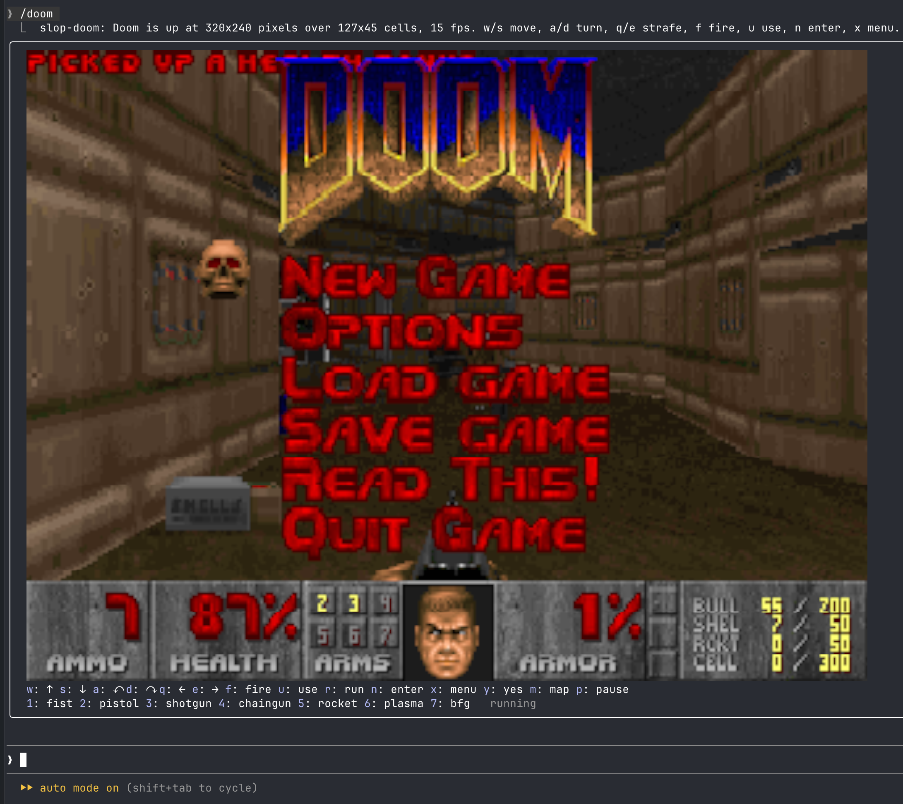

# slop-doom

DOOM (the shareware episode) in a Claude Code pane.



In kitty and Ghostty the pane shows DOOM's own 320 by 200 pixels; everywhere else it draws them in quadrant characters, four pixels a cell.

`/doom` opens the game at the largest 4:3 picture the terminal fits, up to 160 columns; `/doom 120` picks a width; `/doom 120 20` also sets the frames a second for that run; `/doom cells` forces the character display and `/doom image` the pixel one; `/doom close` ends it. Esc hands the keys back to the prompt while the game keeps running; `ctrl+x tab` or a click returns them.

## Keys

| key | does |
| --- | --- |
| `w` `s` | forward, back |
| `a` `d` | turn |
| `q` `e` | strafe |
| `f` | fire |
| `u` | use: doors, switches |
| `r` | run, toggled |
| `n` | enter |
| `x` | menu (DOOM's Escape) |
| `y` | yes |
| `m` | map |
| `p` | pause |
| `1` to `7` | fist, pistol, shotgun, chaingun, rocket, plasma, bfg |

A press holds the key for 160 ms, and the terminal's key repeat extends the hold, so holding `w` walks. Run stays on until pressed again.

## Requirements

`bun` on the PATH, or `node` 23.6 or newer. The sidecar is TypeScript and either runs it as is.

## How it works

The plugin sandbox has no WebAssembly and no Node, so DOOM runs in a sidecar process that `$.process.spawn` starts: `sidecar/doom.ts` loads the doomgeneric WASM build, ticks it at 35 Hz, and hands over frames at the chosen rate. The child's stdin is closed at start, so keys travel through a small file the hooks module rewrites on every press and release and the sidecar polls between ticks.

**Pixels.** On a terminal that draws pictures (`TERM_PROGRAM` says ghostty or kitty, or `KITTY_WINDOW_ID` is set, and not under tmux) the pane holds an `Image`. The sidecar writes each frame as raw RGB to a file in the temp directory, renaming it into place so no read sees half a frame, and the hooks module blits the file's name with a new generation number; the terminal reads the pixels itself, nothing crosses the plugin. DOOM's 320 by 200 was drawn for a 4:3 screen with pixels 1.2 times taller than wide, so the frame goes out as 320 by 240 and fills a 4:3 box exactly. If the terminal refuses the picture, the mod restarts on the character display and stays there for the session.

**Characters.** Elsewhere each frame is a terminal `Raster`: every cell shows a 2 by 2 block of pixels as one quadrant glyph (`▘ ▝ ▀ ▖ ▌ ▞ ▛ ▗ ▚ ▐ ▜ ▄ ▙ ▟`) in two colours, chosen as the split of the four that loses least, so 127 columns show 254 by 90 pixels. Each picture pixel covers a small rectangle of the 640 by 400 frame, and `--filter` picks how that rectangle becomes one colour: `mode` (the default) averages only the pixels of the rectangle's most common colour, which keeps edges crisp; `box` averages everything; `nearest` takes one pixel. A Raster frame may hold 1024 distinct colour pairs; past that the rarest pairs are redirected to their nearest kept pair, which measures within 0.1 dB of no cap at all, and the redirects are remembered from frame to frame so the search runs only for pairs whose target dropped out.

The pane's height follows the terminal's: the band above the prompt reports the viewport's rows on every draw, and a bare `/doom` keeps the picture plus its hotkey rows on screen.

Settings in `/config`: `Frames per second` (default 15); `Display` (`auto`, `image`, `cells`); `Cell shape`, your cell's width over its height (default 0.47; raise it if bands show beside the picture, lower it if above and below); `Cells glyphs` (`quad`, or `half` for fonts whose quadrants leave seams); `Cells filter` (`mode`, `box`, `nearest`).

## Install

```
/plugin install slop-doom --marketplace wobondar/claude-plugins
```

Answer `y` to add the marketplace, then pick a scope. To run from a checkout instead: `claude --plugin-dir ./mods/slop-doom`.

## Develop

```
claude plugin validate ./mods/slop-doom
claude plugin test ./mods/slop-doom
bun ./mods/slop-doom/sidecar/doom.ts --cols 127 --rows 45 --fps 20 --keys /tmp/keys.txt
bun ./mods/slop-doom/sidecar/doom.ts --fps 20 --out /tmp/doom.rgb
```

The first prints `F <base64 cells>` lines and, every 200 frames, how long packing took; the second writes 320 by 240 RGB frames to the file and prints `I <generation>`. The key-hold model, the line splitter, the display choice and the pane shapes live in `hooks/wire.ts`; the quadrant packer and the pair budget in `sidecar/cells.ts`, with no Node imports so the plugin tests cover it. The WASM build is pi-doom's, unchanged; rebuilding it needs Emscripten and `doomgeneric_pi.c` from that repo.

## Credits

- [id Software](https://github.com/id-Software/DOOM) for DOOM and the shareware episode
- [doomgeneric](https://github.com/ozkl/doomgeneric) by Ozkan Sezer, the portable DOOM this runs
- [pi-doom](https://github.com/badlogic/pi-doom) by Mario Zechner, whose Emscripten build this uses as is, and whose half-block rendering the character display grew from
- [opentui-doom](https://github.com/muhammedaksam/opentui-doom) by Muhammed Aksam, which showed DOOM in a TUI first

## License

GPL-2.0, see [LICENSE](LICENSE). The rest of this repository is MIT; this mod is the exception because it embeds DOOM.
