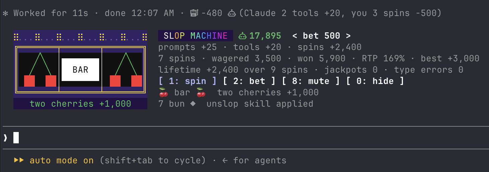
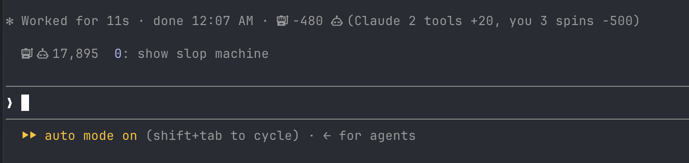

# slop-machine

A three-reel slot machine inside Claude Code, paid in `󱚦` CLD (Claude Dollars).



The machine lives in the band above the prompt. Beside the reels: the balance and the bet, the session's income by source, the session's spin stats, the lifetime hall of fame, and the last two spins.

Digits work at an empty prompt: `1` spins, `2` cycles the bet (25, 50, 100, 250, 500), `8` mutes and unmutes (kept across sessions), `0` hides the band to one line. The buttons are clickable too.



While a turn runs, the spinner line (`Sauteing… 12s`) carries a live meter: Claude's tool calls and what they will pay, your spins so far, the balance.

## The economy

| source | pays |
| --- | --- |
| every character of a prompt you send | +1 |
| every tool call Claude makes | +10, paid at the end of the turn |
| every tenth tool call in a turn | +100 combo |
| the word `yeet` in a prompt | +100 |
| spinning | whatever the reels say |

The balance lasts the session (it survives hot reloads). A hall of fame (lifetime net, biggest win, jackpots, type errors) persists across sessions. The balance may go negative: that is Claude Credit.

After each turn a toast and the band's readout say what we earned together: Claude's tool calls plus your spins. The turn's closing line (`✻ Baked for 3s · done 6:04 PM`) carries the tally too.

## Reels

| symbol | three of a kind | pair |
| --- | --- | --- |
| 7 | 77x (JACKPOT, with fanfare and a voice) | 1.2x |
| $ coin | 25x | 1.2x |
| bun | 20x | 1.2x |
| diamond | 15x | 1.2x |
| BAR | 10x | 1.2x |
| cherry | 6x | 2x; a single cherry returns 0.6x |
| `any` | -4x (TYPE ERROR; your TypeScript license is revoked, audibly) | nothing |

The return to player is generous. The house is Claude and Claude is paid in tokens.

## Commands

- `/slop` or `/slop stats` prints session and lifetime stats
- `/slop bet <n>`
- `/slop stats`
- `/slop reset`
- `/slop hide`, `/slop show`

The command runs mid-turn too.

## Settings

`/config` lists the mod's rows: `Sounds` (generated WAV clips, macOS), `Announcer voice` (macOS `say` on jackpots and type errors), `Starting balance`. `8` on the band mutes both without touching the settings.

## Install

```
/plugin install slop-machine --marketplace wobondar/claude-plugins
```

Answer `y` to add the marketplace, then pick a scope. To run from a checkout instead: `claude --plugin-dir ./mods/slop-machine`.

## Develop

```
claude plugin validate ./mods/slop-machine
claude plugin test ./mods/slop-machine
bun ./mods/slop-machine/scripts/make-sounds.ts
```

The reels are rendered as one `Raster` (25 by 7 cells) on the terminal and as text on other surfaces. A spin is 30 frames a second through `$.ui.blit`, no render pass; state is written only when a reel lands, each landing with a one-row bounce. The title is a second Raster, a retro gradient blitted every 140 ms. The pure parts live in `hooks/reels.ts` (strip, payouts, spin plan) and `hooks/raster.ts` (tiles, frame, base64 packing).
