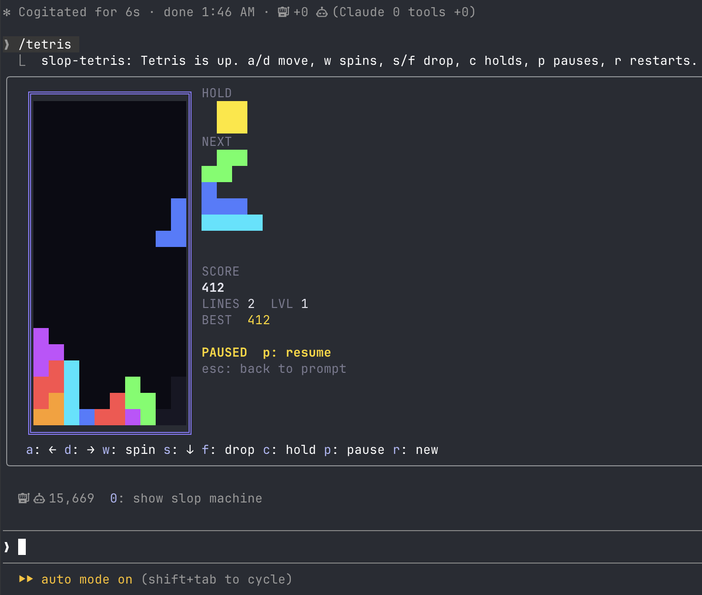

# slop-tetris

Tetris in a Claude Code pane. No wallet, no economy, just blocks.



`/tetris` opens the pane with the keyboard; `/tetris close` closes it. Esc hands the keys back to the prompt without closing the game, and the pane keeps running in the background.

## Keys

The pane has to hold the keyboard (it does right after `/tetris`; `ctrl+x tab` or a click brings it back).

| key | does |
| --- | --- |
| `a` `d` | move |
| `w` | rotate |
| `s` | soft drop, +1 a row |
| `f` | hard drop, +2 a row |
| `c` | hold, once per piece |
| `p` | pause |
| `r` | new game |

Arrows walk the pane's focus ring, as in every pane; the letters are the controls.

## Rules

10 by 20 well, 7-bag randomizer, three-piece preview, hold, ghost piece, full SRS rotation with wall kicks (the I piece has its own table), half a second of lock delay that resets on a move or a turn. Levels climb every ten lines and the fall speeds up on the guideline curve. A single pays 100, a double 300, a triple 500, a tetris 800, each times the level. The high score persists across sessions.

## Integration

The game publishes to `$.state` under `slop-tetris`: `live` (phase, score, lines, level, pieces, whether the pane is open), `lastGame` (the last finished game) and `highScore`. Another plugin reads them, or hooks `state.set` on `lastGame` to react to a finished game. Tetris never reads anyone else's state.

## Install

```
/plugin install slop-tetris --marketplace wobondar/claude-plugins
```

Answer `y` to add the marketplace, then pick a scope. To run from a checkout instead: `claude --plugin-dir ./mods/slop-tetris`.

## Develop

```
claude plugin validate ./mods/slop-tetris
claude plugin test ./mods/slop-tetris
```

The pure game lives in `hooks/tetris.ts`, every move a function from a game to a game. `hooks/game.tsx` is a `Client` surface module: it owns the running game, ticks at 20 frames a second on `surface.every`, draws the well with coloured `Text` cells and posts a summary to the hooks module whenever the score, lines, level or phase change. `hooks/register.tsx` opens the pane, draws the control buttons under the `Client` and relays each press to the game as a numbered command in its props.
